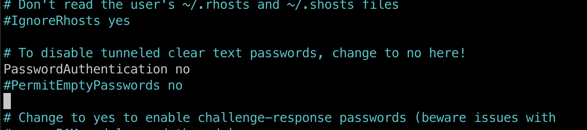

[На главную](/){ .md-button }
##
# Linux
Установка программ / пакетов / полезные команды

### Обновляем спис­ки пакетов / обновление всех установленных пакетов до их последних версий
```
sudo apt update
```
```
sudo apt upgrade
```

* удалить пакет
```
sudo apt remove [package-name]
```
* поиск пакета по репозиториям
```
sudo apt search [package-name]
```
* все доступные пакеты
```
sudo apt list
```
 
---
## ssh

### Сгенерировать ключ
```
ssh-keygen -t rsa
```

### Вывести ключ в терминал
```
cat ~/.ssh/id_rsa.pub
```

### Скопировать ключ на удаленный сервер
После ввода команды, введите пароль (не будет отображаться) и нажмите ENTER. Утилита скопирует содержимое открытого ключа (~/.ssh/id_rsa.pub) на удаленный сервер в файл authorized_keys.
```
ssh-copy-id root@00.000.000.000
```

### Если соединение быстро обрывается можно использовать эту команду
```
ssh -o ServerAliveInterval=60 root@00.000.000.000
```

### Зайти на сервер по ssh
```
ssh root@00.000.000.000
```


---

## Учетные записи

### меняем пароль пользователя ROOT
при вво­де сим­волы не отоб­ража­ются — нет ни букв, ни цифр, ни звез­дочек, это нор­маль­но, вве­ди новый пароль и наж­ми Enter
```
passwd
```

### Запрет входа по паролю ROOT
когда вы убедились, что можете войти на сервер по SSH-ключу, стоит отключить возможность входа по паролю. Откройте файл конфигурации SSH
```
sudo nano /etc/ssh/sshd_config
```

### PasswordAuthentication no

Раскомментируйте (убрав # в начале строки) параметр PasswordAuthentication и укажите значение no, получив строку вида
{ loading=lazy }
```
PasswordAuthentication no
```


### перезапустите службу SSH
сохраните файл и перезапустите службу SSH командой
```
sudo service ssh restart
```


---

### добавить учетную запись
следуйте инструкциям, чтобы установить пароль и заполнить другую информацию
```
adduser coder
```

### добавить права суперпользователя для пользователя coder
добавьте пользователя coder в группу sudo, используя команду
```
usermod -aG sudo coder
```

### проверьте, что пользователь добавлен в группу sudo, выполните команду
```
groups coder
```


---

* установить пароль новому пользователю
```
passwd coder
```
* удалить пользователя
```
deluser coder
```
```
userdel coder
```


### информация об учетных записях пользователей
```
cat /etc/passwd
```
группы
```
cat /etc/group
```
конфигурация для sudo
```
sudo cat /etc/sudoers
```
кто вошел в систему
```
who
```
```
w
```
последние сеансы входа в систему
```
last
```


---

## Установка программ

### MCeditor
```
sudo apt install mc
```

### Nginx
```
sudo apt install nginx
```

* Добавление Nginx в автозагрузку:
```
sudo systemctl enable nginx
```
* Проверка статуса работы веб-сервера:
```
sudo service nginx status
```


---

## Commands
получение списка ранее выполненных команд
```
history
```
переменные окружения
```
env
```
узнать имя пользователя

```
echo $USER
```

определить местоположение команды
```
which ls
```
